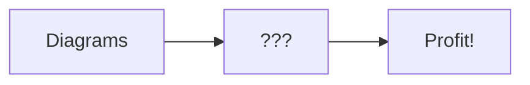
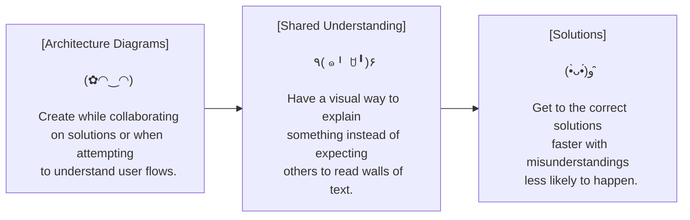

# Mermaid Syntax Playground

Mermaid syntax is a way to create charts and diagrams with markdown, instead of having to manually draw them out using some kind of graphics tool. It's 1000x faster, can be modified on the fly during discussions, easier to embed and share, and quick to learn.

Seriously though...

