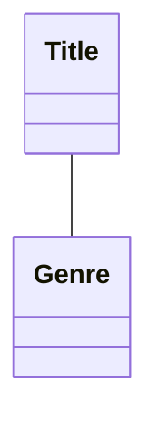
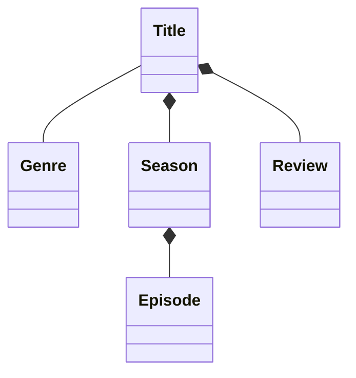
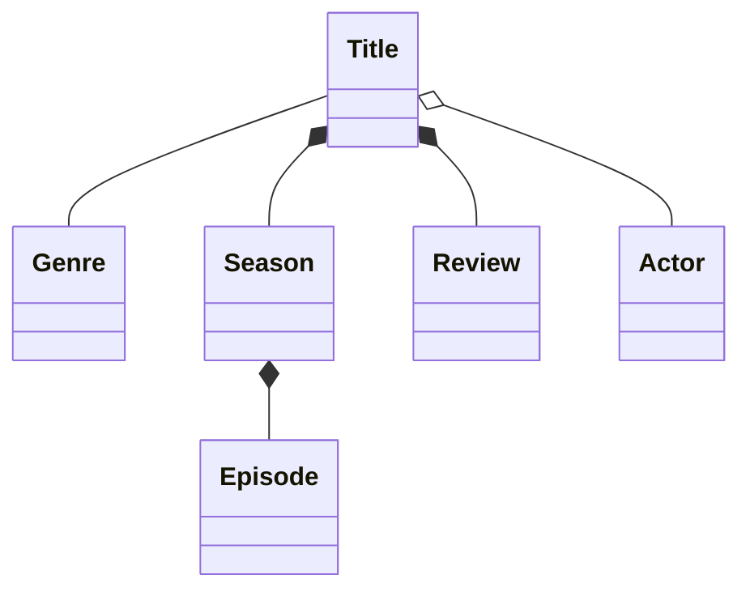
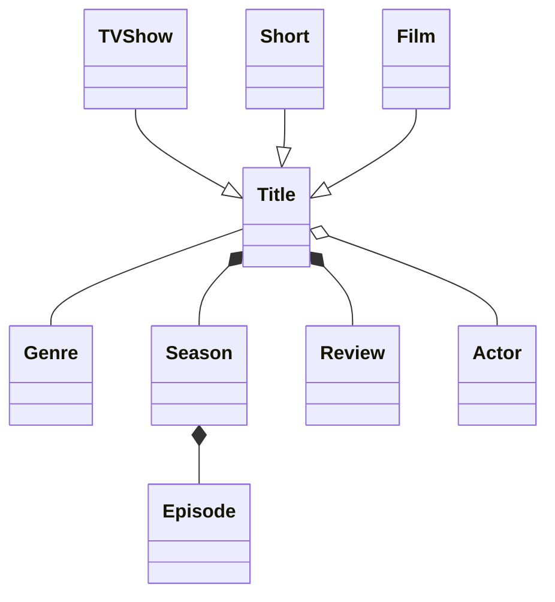
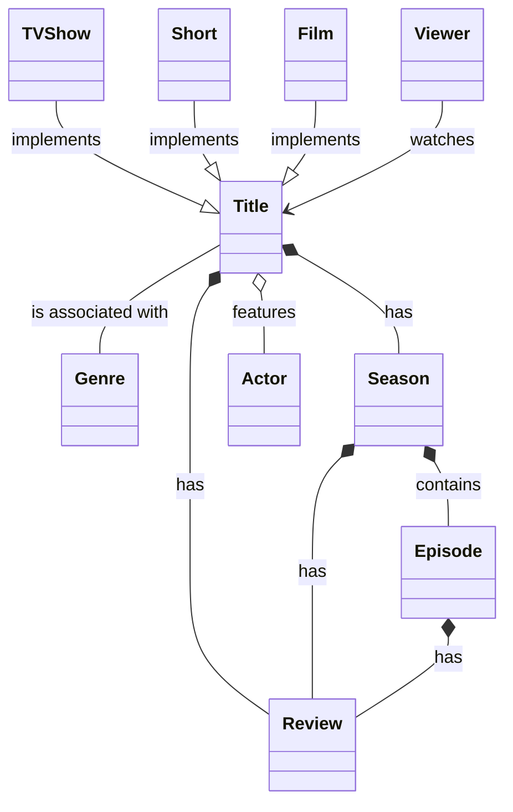
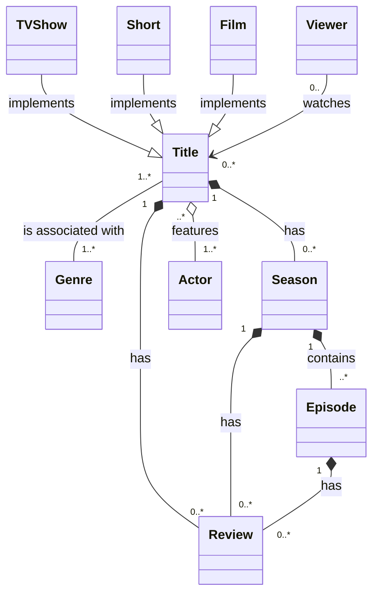

# Definitions
## Domain / Class Diagram UML

## Domain Modeling
The primary way of determining the important aspects of a business, with domain-driven design being the methodology used to bring that model to life in day-today-work.
* For each entity, a node is added
* Relationships are defined between entities as associations, composites, aggregates, or generalizations.
* Multiplicity is defined

### Associations
Two entities that are loosely related and can exist independent of one another. No relationship owner.
Identified with `--`.
**Examples**:
```
Title -- Genre
Teacher -- Student
```

### Associations
Two entities that are loosely related and can exist independent of one another. No relationship owner.
Identified with `--`.
**Examples**:
```
Title -- Genre
Teacher -- Student
```



### Compositions
Two entities that are tightly related and cannot exist independently of one another. There is a relationship 'owner'. If a parent is deleted, the child must be.
Identified with `*--`.
**Examples**:
```
Title \*-- Season
Title \*-- Review
Class \*-- Grade
```



### Aggregations
Two entities that can exist independently of one another, but there's an owner of the relationship. If the parent is deleted, the child can remain.
Identified with `o--`.
**Examples**:
```
Title o-- Actor
Class o-- Teacher
```



### Generalizations
Identify sub-classes that inherit from larger classes.
Identified with `--|>`.
**Examples**:
*Dog --|> Animal*
*Cat --|> Animal*



### Relationship Descriptions
`--` shows bidirectional association but arrows `-->` can also be used for directional association. Using `: description` after a relationship will show the explanation.
**Examples**:
*Title -- Genre: is associated with*
*Viewer --> Title: watches*



### Multiplicity
Define one-to-one, one-to-many, none-to-many, many-to-many, or other types of multiplicity.
**Examples**
```
Title "1" *-- "0..\*" Season: has
```
* Title has zero to many Seasons
* Season belongs to one Title
```
Title "1" \*-- "0..\*" Review: has
```



### Diagram Title
Add the following block of code to any markup:
```
title: Streamy Domain Model
\n\n
```

### Linking nodes to pages
Add the following to add a link to a node:
```
link Title "http://www.example.com" _blank
```


### Mermaid: Full Diagram
```
classDiagram
  Title "1..*" -- "1..*" Genre: is associated with
  Title "1" *-- "0..*" Season: has
  Title "1" *-- "0..*" Review: has
  Title "..*" o-- "1..*" Actor: features

  TVShow --|> Title: implements
  Short --|> Title: implements
  Film --|> Title: implements

  Viewer "0.." --> "0..*" Title: watches

  Season "1" *-- "0..*" Review: has
  Season "1" *-- "..*" Episode: contains

  Episode "1" *-- "0..*" Review: has
```