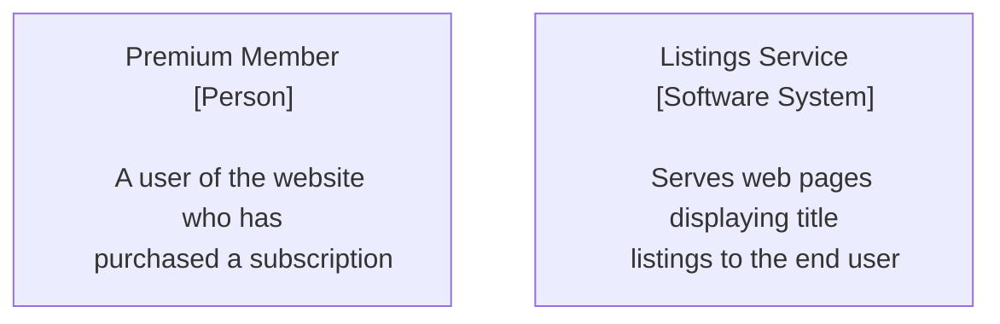
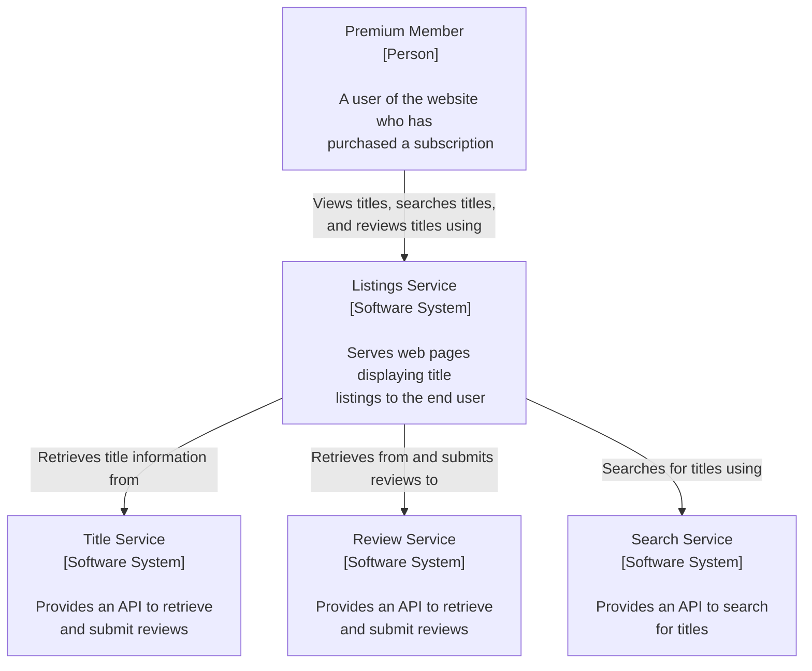
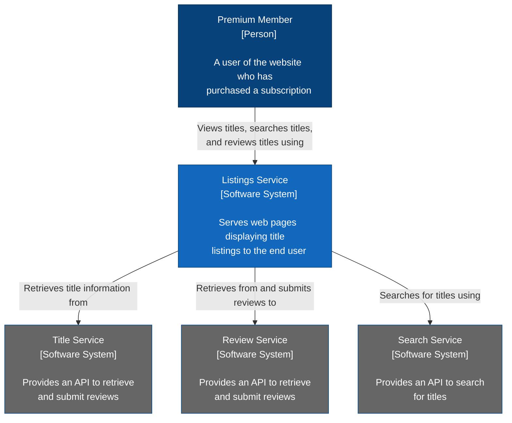

# C4 System Context

## Listings Service

### General Requirements
* When a user goes to the platform, what does the listings service need to do to show the titles, and how does it do it?
* When a title is displayed, the reviews for that title are also displayed, and the user has the option to submit a review for that title if they wish
* User shoudl also be able to search for specific titles if they want to watch a particular one
* Three other services already exist: title service, review service, search service

### Elements of a system context diagram
* People
* System to design
* Supporting software systems

### Audience
A system context diagram should be readable by anyone, including non-technical people, and show a high level overview of architecture.

### Mermaid: Adding Nodes
To create a flowchart, the mermaid keyword `flowchart` is used along with one of the following keywords:
* TB: top-to-bottom
* TD: top-down (same as top-to-bottom)
* BT: bottom-to-top
* RL: right-to-left
* LR: left-to-right

**Example**
```
flowchart TD
```

The second line defines a `node`, which can be used elsewhere. All node definitions follow the format `id["Label/Description"]`. The ID is the reference used when defining interactions later. The label/description is what goes in the rendered box. Following Simon Brown's notation, each node should contain a title, label, and description.
* **Title**: Should clearly outline the node
* **Label**: What type the node is
* **Description**: What the node represents



### Connecting Nodes
For a system context diagram, just simple solid arrowheads are needed to show dependencies. Arrows can be added by linking and describing a relationship.

**Example**
```
User-- "Views titles, ...." -->LS
ParentNode-->|"arrow label"|ChildNode
```



### Styling & Final Chart
Based on Simon Brown's notation, people should be dark blue, systems should be a lighter blue, and supporting systems should be gray. Styling can be done by using a combination of CSS and SVG. Style classes can be defined and then set to entities.

**Example**
```
classDef person fill:#08427b, stroke: #052e56, color: #fff
```



```
flowchart TD
  User["Premium Member
   [Person]

   A user of the website who has
   purchased a subscription"]

   LS["Listings Service
   [Software System]

   Serves web pages displaying title
   listings to the end user"]

   TS["Title Service
   [Software System]

   Provides an API to retrieve
   and submit reviews"]

   RS["Review Service
   [Software System]

   Provides an API to retrieve
   and submit reviews"]

   SS["Search Service
   [Software System]

   Provides an API to search
   for titles"]

   User-- "Views titles, searches titles,
   and reviews titles using" -->LS

   LS-- "Retrieves title information from" -->TS
   LS-- "Retrieves from and submits reviews to" -->RS
   LS-- "Searches for titles using" -->SS

   classDef focus fill:#1168bd, stroke: #0b4884, color: #fff
   classDef supporting fill:#666, stroke: #0b4884, color: #fff
   classDef person fill:#08427b, stroke:#052e56, color: #fff

   class User person
   class LS focus
   class TS,RS,SS supporting
```