# C4 System Containers

## C4 System Container Diagram
A container is considered a single deployable unit, not to be confused with a Docker container. An example would be a Java app and a Postgres DB. Slightly more technical than a system context diagram and provides a more 'zoomed in' description of a system.

## Listings Example
* A mobile app for mobile users
* A web app that serves web browsers and also hosts an API for the mobile app to retrieve and send data to and from
* A Redis instance for caching, to prevent repeated API calls to downstream services, such as the title service
* Kafka message broker, that receives domain events (user views listing, user watches title) Note: Won't be on this diagram

### Flowchart
This diagram also uses a top-down flowchart style.

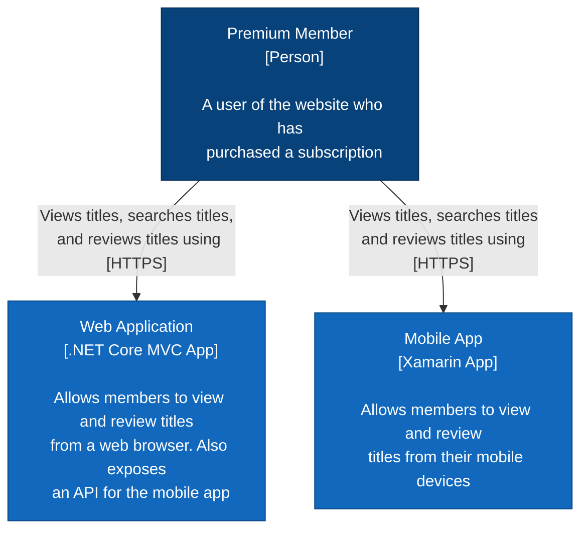

### Subgraphs
The boundary of the system can be highlighted with a subgraph so it's more clear. For C4 diagrams, they're meant to differentiate system's containers, within a boundary, from the rest of the nodes.
Additionally, different shapes can be used to differentiate a regular node from a datastore.

**Example - Subgraph**

```
subgraph listing-service[Listing Service]
  MA-- "Makes API calls to\n[HTTPS]" -->WA
  WA-- "Reads and writes to\n[Redis]" -->R
end
```

**Example - Shape Change**

```
R[("In-Memory Cache")]
Circle[(("This creates a circle))]
Diamond[{"This creates a diamond"}]
```

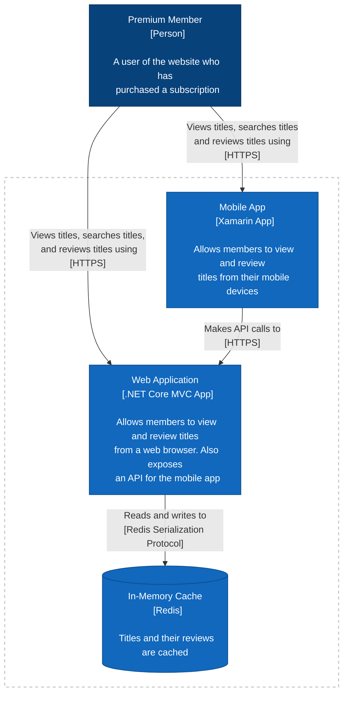

### Adding Supporting Services / Link Lengths
Displaying additional services that a workflow relies on but won't require additional work themselves. Mermaid automatically ranks nodes based on definitions, such as person and app. Child nodes always sit below parents. Rank can be manually adjusted to ensure systems fall below other systems when needed.

**Example**
The following will display the supporting services at the same level as Redis:
```
  WA-- "Makes API calls to\n[HTTPS]" -->TS
```
A slight modification to the hyphen on the last arrow will push it to the next level:
```
  WA-- "Makes API calls to\n[HTTPS]" --->TS
```


### Displaying Async Interactions
Interactions between an application and message broker will always be asynchronous, and this can be notated by displaying a dotted line instead of a solid one.

```
ParentNode-. "arrow text" .->ChildNode
```

**Example**

Regular synchronous line:
```
WA-- "Publishes messages to\n[Binary over TCP]" --->K
```

Dotted aync line:
```
WA-. "Publishes messages to\n[Binary over TCP]" ..->K
```

### Final Diagram

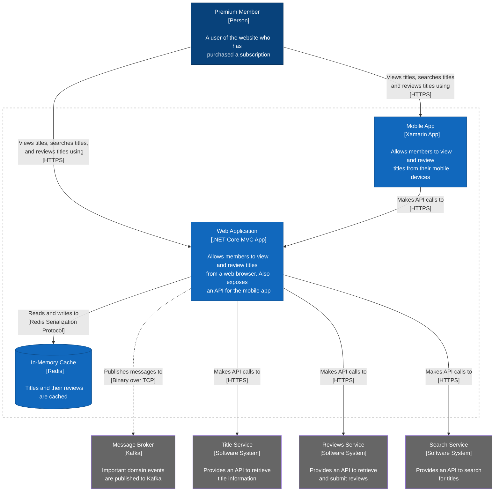

```
flowchart TD
  User["Premium Member
  [Person]
  
  A user of the website who has
  purchased a subscription"]

  WA["Web Application
  [.NET Core MVC App]
  
  Allows members to view and review titles
  from a web browser. Also exposes
  an API for the mobile app"]

  MA["Mobile App
  [Xamarin App]
  
  Allows members to view and review
  titles from their mobile devices"]

  R[("In-Memory Cache
  [Redis]
  
  Titles and their reviews are cached")]

  K["Message Broker
  [Kafka]
  
  Important domain events
  are published to Kafka"]

  TS["Title Service
  [Software System]
  
  Provides an API to retrieve
  title information"]

  RS["Reviews Service
  [Software System]
  
  Provides an API to retrieve
  and submit reviews"]

  SS["Search Service
  [Software System]
  
  Provides an API to search
  for titles"]

  User-- "Views titles, searches titles,
  and reviews titles using [HTTPS]" -->WA

  User-- "Views titles, searches titles
  and reviews titles using
  [HTTPS]" -->MA

  subgraph listing-service[Listing Service]
    MA-- "Makes API calls to\n[HTTPS]" -->WA
    WA-- "Reads and writes to\n[Redis Serialization Protocol]" -->R
  end

  WA-. "Publishes messages to\n[Binary over TCP]" ..->K

  WA-- "Makes API calls to\n[HTTPS]" --->TS
  WA-- "Makes API calls to\n[HTTPS]" --->RS
  WA-- "Makes API calls to\n[HTTPS]" --->SS

  classDef container fill:#1168bd, stroke: #0b4884, color: #fff
  classDef person fill:#08427b, stroke: #052e56, color: #fff
  classDef support fill:#666, stroke:#04884, color:#fff
  
  class User person
  class WA,MA,R container
  class TS,RS,SS,K support

  style listing-service fill:none, stroke:#ccc, stroke-width:2px
  style listing-service color:#fff, stroke-dasharray: 5 5
```

### Arrow Reference

**Link with Arrowhead** 
`A --> B`


---

**Link with Arrowhead (with text)**
`A-- "text" -->B or A->|text|B`

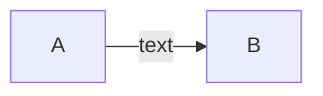

---

**Link with No Arrowhead**
`A---B`

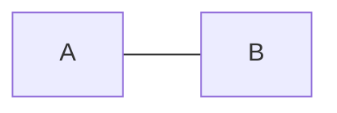

---

**Link with No Arrowhead (with text)**
`A-- "text" ---B or A--|text|B`

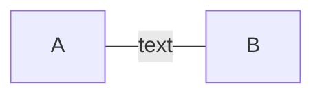

---

**Dotted Link**
`A-.-> B`

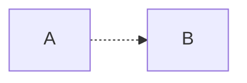

---

**Dotted Link (with text)**
`A-. text .-> B`

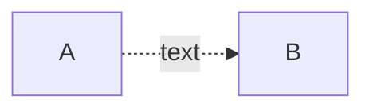

---

**Thick Link with Arrowhead**
`A ==> B`

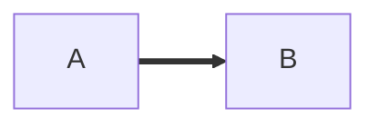

---

**Thick Link with Arrowhead (with text)**
`A == text ==> B`

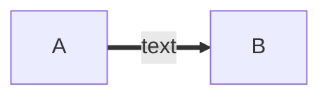

---

**Chaining Links**
`A -- text --> B -- text2 --> C`

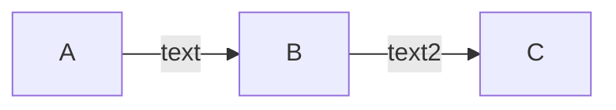

---

**Multiple Links**
`A -->  B & C --> D`

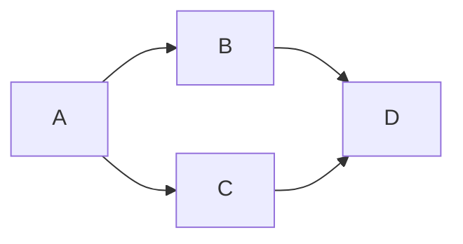