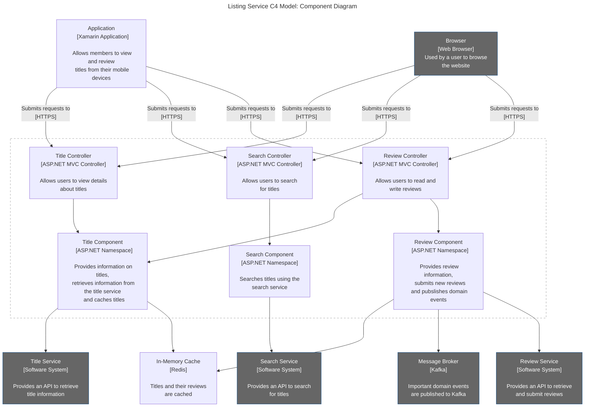

# C4 System Components

## C4 System Component Diagram
Equivalent of a high-level namespace or module, or some sort of library or package that's included in a container. Should provide the major building blocks of each container. This diagram is optional, since it's difficult to keep up-to-date with how quickly it can change.

There's more value in adding component diagrams for larger systems, such as modular monoliths where high-level components map to domains.

For granular microservices, component diagrams are wasted effort, since the majority of useful information can be provided via a container diagram.

### Listing Service Example



```
flowchart TD
  Browser["Browser
  [Web Browser]
  Used by a user to browse
  the website"]

  MA["Application
  [Xamarin Application]
  
  Allows members to view and review
  titles from their mobile devices"]

  R["In-Memory Cache
  [Redis]
  
  Titles and their reviews
  are cached"]

  K["Message Broker
  [Kafka]
  
  Important domain events
  are published to Kafka"]

  TS["Title Service
  [Software System]
  
  Provides an API to retrieve
  title information"]

  RS["Review Service
  [Software System]
  
  Provides an API to retrieve
  and submit reviews"]

  SS["Search Service
  [Software System]
  
  Provides an API to search
  for titles"]

  TCont["Title Controller
  [ASP.NET MVC Controller]

  Allows users to view details
  about titles"]

  SCont["Search Controller
  [ASP.NET MVC Controller]
  
  Allows users to search
  for titles"]

  RCont["Review Controller
  [ASP.NET MVC Controller]
  
  Allows users to read and
  write reviews"]

  TComp["Title Component
  [ASP.NET Namespace]
  
  Provides information on titles,
  retrieves information from the title service
  and caches titles"]

  SComp["Search Component
  [ASP.NET Namespace]
  
  Searches titles using the
  search service"]

  RComp["Review Component
  [ASP.NET Namespace]
  
  Provides review information,
  submits new reviews
  and pubslishes domain events"]

  Browser-- "Submits requests to\n[HTTPS]" --->TCont
  MA-- "Submits requests to\n[HTTPS]" --->TCont

  MA-- "Submits requests to\n[HTTPS]" --->SCont
  Browser-- "Submits requests to\n[HTTPS]" --->SCont

  MA-- "Submits requests to\n[HTTPS]" --->RCont
  Browser-- "Submits requests to\n[HTTPS]" --->RCont

  subgraph listing-service[Listing Service]
    TCont--->TComp
    RCont--->TComp
    RCont--->RComp
    SCont--->SComp
  end

  TComp--->TS
  TComp--->R
  RComp--->R
  RComp--->K
  RComp--->RS
  SComp--->SS

  classDef container fill:#1168bd, stroke:#0b4884, color:#fff
  classDef external fill:#666, stroke:#0b4884, color:#fff
  classDef component fill:#85bbf0, stroke:#5d82a8, color:#000

  class MA,R Container
  class SS,RS,TS,K,Browser external
  class RComp,SComp,TComp,RCont,SCont,TCont componetn
  style listing-service fill:none, stroke:#ccc, stroke-width:2px
  style listing-service color:#fff, stroke-dasharray: 5 5
```