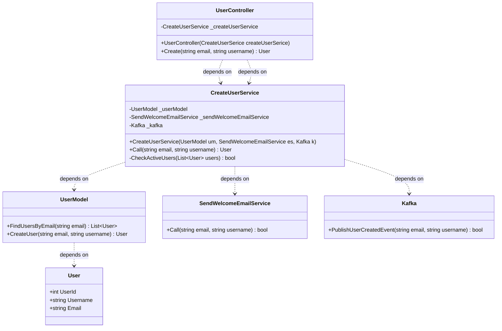
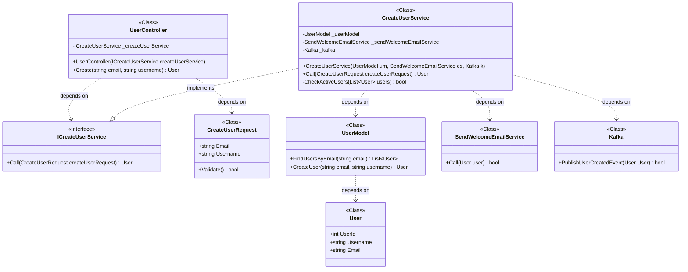

# Class Diagram

### Use Cases
* Larger refactors, and what methods and dependencies are at play

### Class Diagram vs Regular Domain Diagram
They both use mermaid `classDiagram`.
It's ideal to define classes separately, before relationships.
* Visibility of a property is identified with private `-` or public `+`
* Dependencies are identified with arrows, such as `..>`



### Refactoring
*Identify code smells:*
Several classes contain the same parameters, but each time we're passing parameters individually as primitive types. If we had more parameters, the code smell would be `long parameter list`, but since there are 2, it's a `data clump`. This code smell can be identified by having the same pieces of data passed together, but as separate parameters.

To fix, create a class to group data points and pass that in the method signature instead (instance of User).

Another code smell is that concrete implementations of classes are relied on, instead of using interfaces, which would use no logic and just define methods that a class must implement to fill a contract.

**Example**
```
class ICreateUserService {
  <<Interface>>
  +Call(CreateUserRequest createUserRequest) User
}
```

### Final Diagram


