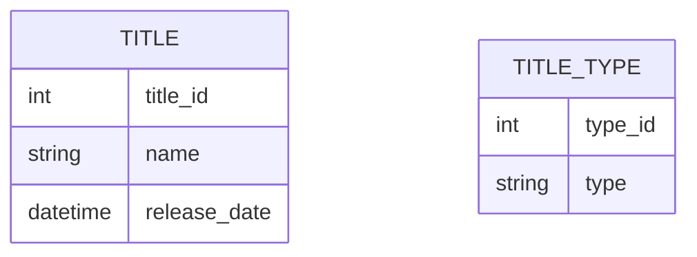
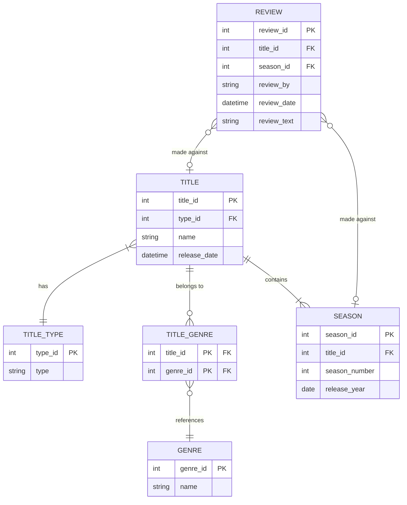
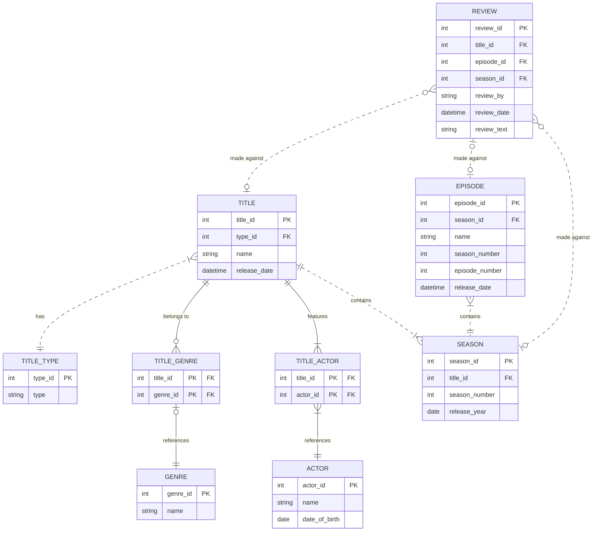

# ERD Snapshots

### Snapshot Diagrams
Entity Relationship Diagrams, or ERDs, are great to use to design an initial system. There's no reason to manually update one since most DB tooling can generate these for you. The following 3 scenarios are when manually creating an ERD is useful:
- When writing architecture decision records (ADR)s for brand new services, to show a snapshot of a database design at a given point in time.
- When making significant schema changes to an existing service, to visually show how the schema will change.
- When making small schema changes, to visualize whether the change makes sense, or to explain the change to others.

### Creating Table Entities
The mermaid `erDiagram` type can be used to create ERDs. The following syntax can be used to define entities:

```
  TITLE {
    int title_id
    string name
    datetime release_date
  }
```



### Relate Entities & Keys
To identify cardinality, the following format can be used: 
`ENTITY_NAME_1 CARDINALITY--CARDINALITY ENTITY_NAME_2`

The following types are available:
|Type|Syntax|
|---|---|
|Exactly one|`||`|
|One-to-many|`}|`|
|Zero-to-many|`o{`|
|Zero-or-one|`o|`|

**Example**
```
TITLE }|--|| TITLE_TYPE: has
```

Additionally, entity fields can be marked with PK or FK to denote primary and foreign keys, along with text in quotes after a key to display notes within the diagram.

**Example**

```
TITLE_GENRE {
  int title_id PK "FK"
  int genre_id PK "FK"
}
```



### Non-Identifying Relationships
Can two entities exist independently of one another? We can use keys between entities to decide between identifying and non-identifying. If the primary key of a parent entity is included in the primary ke of a child entity, it's an identifying relationship. If a parent entity's primary key is not included in the child entity's primary key, it's non-identifying.
To directly mark a relationship as non-identifying, `..` can be used. This will turn a solid line into a dashed one.

**Example**

```
TITLE ||..|| TITLE_TYPE: has
```

In a larger app, a classic example of identifying relationships is where a domain entity is broken down into many database entities, such as breaking down a USER entity into multiple smaller entities, like USER_ADDRESS, USER_EMAIL, and USER_PHONE_NUMBER.

### Final ERD



```
erDiagram
  TITLE {
    int title_id PK
    int type_id FK
    string name
    datetime release_date
  }
  TITLE_TYPE {
    int type_id PK
    string type
  }
  ACTOR {
    int actor_id PK
    string name
    date date_of_birth
  }
  TITLE_ACTOR {
    int title_id PK "FK"
    int actor_id PK "FK"
  }
  GENRE {
    int genre_id PK
    string name
  }
  TITLE_GENRE {
    int title_id PK "FK"
    int genre_id PK "FK"
  }
  EPISODE {
    int episode_id PK
    int season_id FK
    string name
    int season_number
    int episode_number
    datetime release_date
  }
  SEASON {
    int season_id PK
    int title_id FK
    int season_number
    date release_year
  }
  REVIEW {
    int review_id PK
    int title_id FK
    int episode_id FK
    int season_id FK
    string review_by
    datetime review_date
    string review_text
  }

  TITLE }|..|| TITLE_TYPE: has
  TITLE ||--o{ TITLE_GENRE: "belongs to"
  TITLE ||--|{ TITLE_ACTOR: features
  TITLE ||..|{ SEASON: contains
  TITLE_GENRE |o--|| GENRE: references
  TITLE_ACTOR }|--|| ACTOR: references
  EPISODE }|..|| SEASON: contains
  REVIEW }o..o| TITLE: "made against"
  REVIEW |o..o| EPISODE: "made against"
  REVIEW }o..o| SEASON: "made against"
```