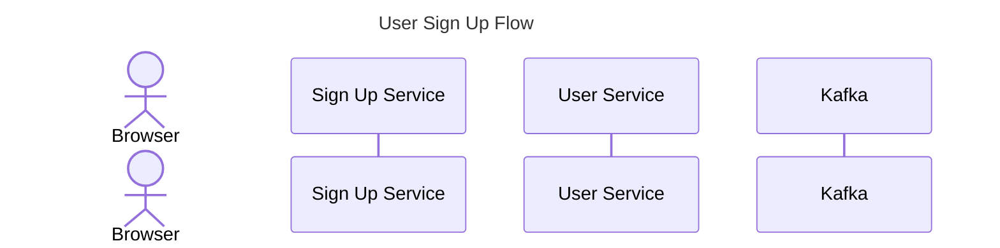
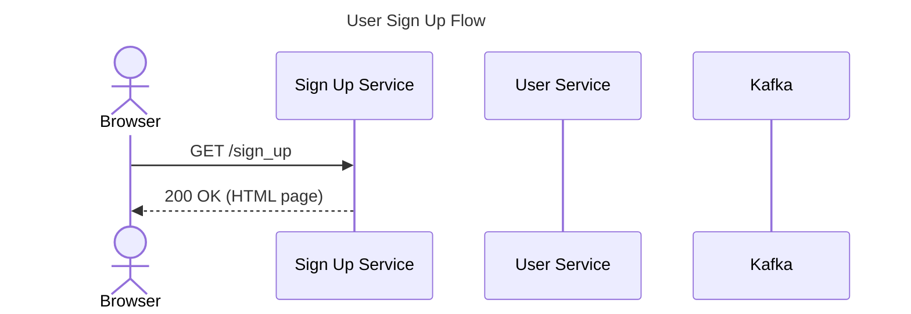
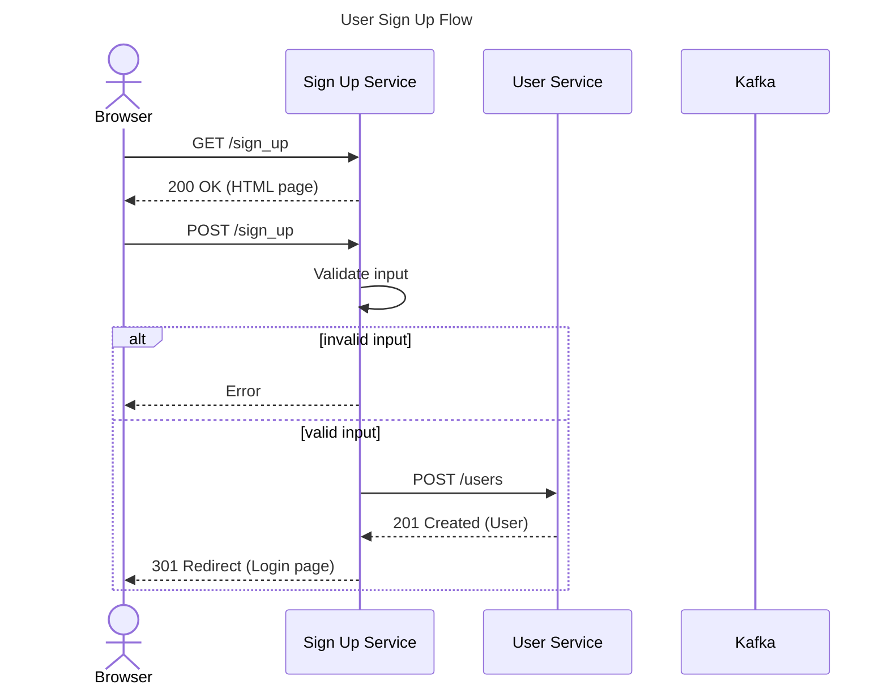
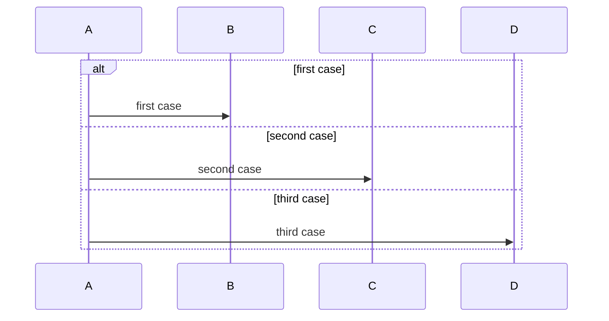
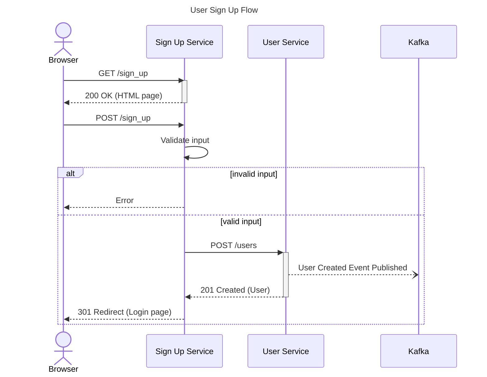
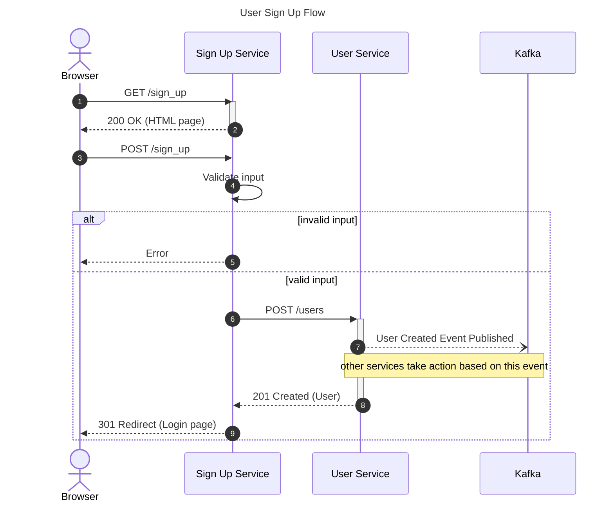

# Sequence Diagrams

### Key Nodes: UML Lifelines
These are defined as `participants`, while actors can be created with `actor`. They denote the major services and client types.

**Example**

```
---
title: User Sign Up Flow
---
sequenceDiagram
  actor Browser
  participant Sign Up Service
  participant User Service
  participant Kafka
```



### Interactions
Interactions between nodes are modeled in the form of messages. 
`->>` can be used for synchronous calls
`-->>` can be used for a response
Text after `:` can be used to describe the interaction.

**Example**
```
Browser ->> Sign Up Service: GET /sign_up
Sign Up Service -->> Browser: 200 OK (HTML page)
```



### Branching Logic
Both major happy and alternative paths should be displayed. To display many alternative paths that can be taken, it's best to use a separate sequence diagram.

**Examples**
```
alt invalid input
  Sign Up Service-->>Browser: Error
else valid input
  Sign Up Service->>User Service: POST /users
  User Service-->>Sign Up Service: 201 Created (User)
  Sign Up Service-->>Browser: 301 Redirect (Login page)
end
```



#### Handling Multiple Alternate Paths
Can be created by using multiple else statements.

**Example**

```
alt first case
  A->>B: first case
else second case
  A->>C: second case
else third case
  A->>D: third case
end
```



### Displaying Async Messages
Denotes an asynchronous sequence.
Defined with `--)`.

**Example**
```
User Service--)Kafka: User Created Event Published
```


### Activations
Can be used to show when a request starts and a response is received. A rectangle helps denote how many messages an interaction takes.
Can be created by using `+` and `-` or activating and deactivating a node.

**Examples**
```
activate Sign up Service
Sign Up Service-->Browser: 200 OK (HTML page)
deactivate Sign Up Service

Sign Up Service->>+User Service: POST / users
User Service-->>-Sign Up Service: 201 Created (User)
```



### Adding Notes
Can be added by using `Note [Left|Right] or [Node]`. Notes can span across multiple nodes. They should be used to supplement the main sequence and shouldn't be necessary to understand the core flow. Ex: Noting a JWT must be used in a request to an external API.

**Example**
```
Note left of Kafka: other services take action based on this event
Note over User Service, Kafka: other services...
```

### Adding Sequence Numbers
Mermaid can provide this automatically by providing the keyword `autonumber` below the sequence diagram line.

### Creating Dropdown Menus
Menus can be added to actors and participants. This can allow you to link to things like service repos, the domain model, or documentation. Links are added in a JSON-like format of key-value pairs:

**Example**
`links User Service: {"Repository": "https://www.google.com/repository"}`

### Full Diagram

#### Mermaid Syntax

```
---
title: User Sign Up Flow
---
sequenceDiagram
  autonumber
  actor Browser
  participant Sign Up Service
  participant User Service
  participant Kafka

  Browser->>Sign Up Service: GET /sign_up
  activate Sign Up Service
  Sign Up Service-->>Browser: 200 OK (HTML page)
  deactivate Sign Up Service
  Browser->>Sign Up Service: POST /sign_up
  Sign Up Service->>Sign Up Service: Validate input

  alt invalid input
    Sign Up Service-->>Browser: Error
  else valid input
    Sign Up Service->>+User Service: POST /users
    User Service--)Kafka: User Created Event Published
    Note over User Service, Kafka: other services take action based on this event
    User Service-->>-Sign Up Service: 201 Created (User)
    Sign Up Service-->>Browser: 301 Redirect (Login page)
  end

  links User Service: {"Repository": "https://www.google.com"}
```

#### Diagram

