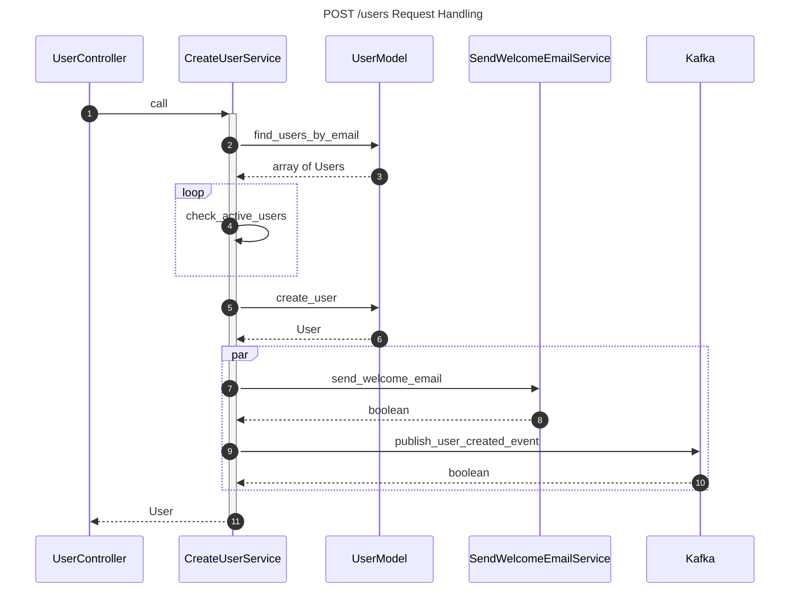

# Class Interactions - Sequence Diagram

### Sequence Diagram Use Cases
* To understand the interactions between classes, such as how code is working for a given process. In this example it describes creating a new user.
* To identify possible inefficiencies in process or interactions that don't make sense. For example, checking for active users in the `CreateUserService` doesn't make any sense--it should be moved into the `UserModel` and done as part of the query. Similarly, sending email and publishing an event in parallel, so are gains in performance worth complexity of handling parallelization?

### Example: POST /users Request Handling
Loops can be created by opening and closing a loop block, with `loop` and `end`. Additionally, actions that can be run in parallel of others can be tagged with a parallel block, which starts with `par` and ends with `end`. Note: This isn't a great example based on best practices, it's just an example diagram.

